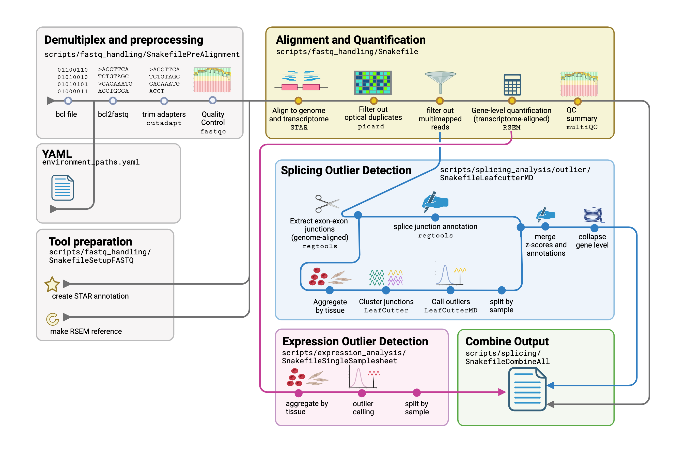

# Pipeline to implement quantification and outlier detection across genome builds
**Contact:** Stephen Montgomery (smontgom@stanford.edu), Rachel Ungar (raungar@stanford.edu), Page Goddard (pgoddard@stanford.edu), Tanner Jensen (tannerj@stanford.edu)
This pipeline is an iteration on the pipeline released in the paper [Identification of rare-disease genes using blood transcriptome sequencing and large control cohorts](https://www.nature.com/articles/s41591-019-0457-8)


# Pipeline Overview

Under scripts

# Analysis Overview

Under analysis_scripts


# Installation Preparation
* if necessary, install Miniconda as recommended [here](https://docs.conda.io/projects/conda/en/latest/user-guide/install/linux.html)

    ```
    wget https://docs.conda.io/en/latest/miniconda.html#linux-installers
    bash Miniconda3-latest-Linux-x86_64.sh
    ```

* install snakemake via conda and mamba as recommended [here](https://snakemake.readthedocs.io/en/stable/getting_started/installation.html)

 n   ```
    conda install -c conda-forge mamba
    mamba create -c conda-forge -c bioconda -n snakemake snakemake
    conda activate snakemake
    snakemake --help
    ```

* Set up a snakemake slurm profile (good install walkthrough [here](http://bluegenes.github.io/Using-Snakemake_Profiles/)) and information on actual use [here](https://www.sichong.site/2020/02/25/snakemake-and-slurm-how-to-manage-workflow-with-resource-constraint-on-hpc/)
    * Setting up the slurm profile requires cookiecutter, which can be installed with conda:

    ```
    conda install -c conda-forge cookiecutter
    ```

# environment_paths.yaml
There should be no direct paths in the snakemake. Please add any paths to the yaml file.

#External Data Resources
 - hg19 annotation: https://www.gencodegenes.org/human/release_35lift37.html > Comprehensive gene annotation (Regions: CHR) 
 - hg38 annotation: https://www.gencodegenes.org/human/release_35.html > Comprehensive gene annotation (Regions: CHR)
 - CHM13v2.0 Annotation: https://github.com/marbl/CHM13#gene-annotation > UCSC GENCODEv35 CAT/Liftoff v2
 - ENCODE Blacklisted Regions for hg19 and hg38: https://github.com/Boyle-Lab/Blacklist/tree/master/lists
 - CHM13 Blacklisted Regions: https://bedbase.org/#/bedsplash/8329d8c624880308ab51ba05149a737d 
 - Official GRC Issues and Incidents Database: https://www.ncbi.nlm.nih.gov/grc/human/issues 
 - data scraped from https://www.ncbi.nlm.nih.gov/projects/genome/assembly/grc/human/issues/filter-data-django.js?d=20150303
 - UCSC Genome Browswer track and download for hg19 issue track from GRC: https://genome.ucsc.edu/cgi-bin/hgTables?db=hg19&hgta_group=map&hgta_track=grcIncidentDb&hgta_table=grcIncidentDb&hgta_doSchema=describe+table+schema
 - UCSC Genome Browswer track and download for hg38 issue track from GRC: https://genome.ucsc.edu/cgi-bin/hgTables?db=hg38&hgta_group=map&hgta_track=grcIncidentDb&hgta_table=grcIncidentDb&hgta_doSchema=describe+table+schema
 - Official documentation of known issues in the CHM13 assembly: https://github.com/marbl/CHM13-issues/blob/main/v2.0_issues.bed
 - bigBedToBed downloaded from: https://hgdownload.soe.ucsc.edu/admin/exe/
 - hg19 vs hg38 build differences (hg38 coordinates): hg38ContigDiff.txt.gz: https://hgdownload.soe.ucsc.edu/goldenPath/hg38/database/ Aug 1 2022 
 - hg19 vs hg38 build differences (hg19 coordinates): hg19ContigDiff.txt.gz: https://hgdownload.cse.ucsc.edu/goldenpath/hg19/database/ Aug 1 2022
 - Table schema / track description: https://genome.ucsc.edu/cgi-bin/hgTables?db=hg38&hgta_group=map&hgta_track=hg38ContigDiff&hgta_table=hg38ContigDiff&hgta_doSchema=describe+table+schema
 - CHM13 vs HG38 non-syntenic regions: chm13v2-unique_to_hg19.bed and chm13v2-unique_to_hg38.bed were downloaded on Oct 19 2022 from this link: https://hgdownload.soe.ucsc.edu/hubs/GCA/009/914/755/GCA_009914755.4/bbi/GCA_009914755.4_T2T-CHM13v2.0.hgUnique/  and represent the regions that are unique to the chm13v2.0 assembly compared to hg19 and hg38, respectively.
 - Build differences in CHM13 vs hg38 for medically relevant genes from table S13: https://www.science.org/doi/10.1126/science.abl3533 